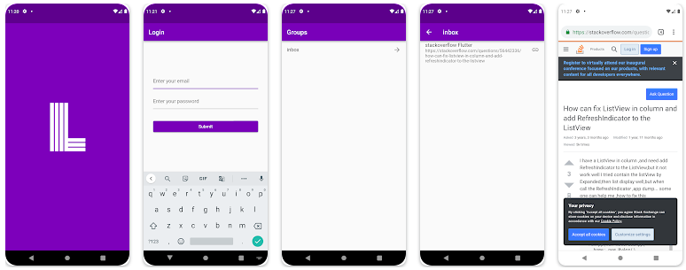

Your bookmarks are now with you.
You can now access libromarko on the android application. 
This first version does not allow any editing for your bookmarks and groups.
We will continue to add new features in new versions.

You still need to use the web application to register.

[Google Play Store](https://play.google.com/store/apps/details?id=xyz.libromarko.app)