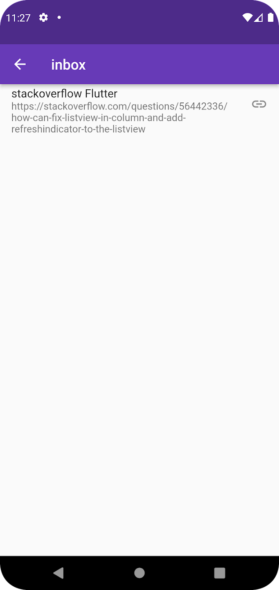

# Inbox

On this screen you can see all the bookmarks the group contains.
You can navigate to the page in your default browser by pressing the bookmark.
The page will automatically open in your default browser.

