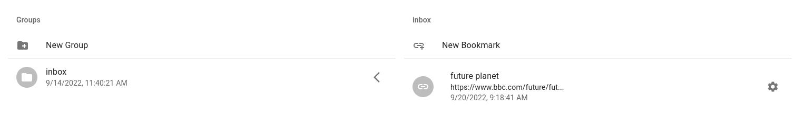
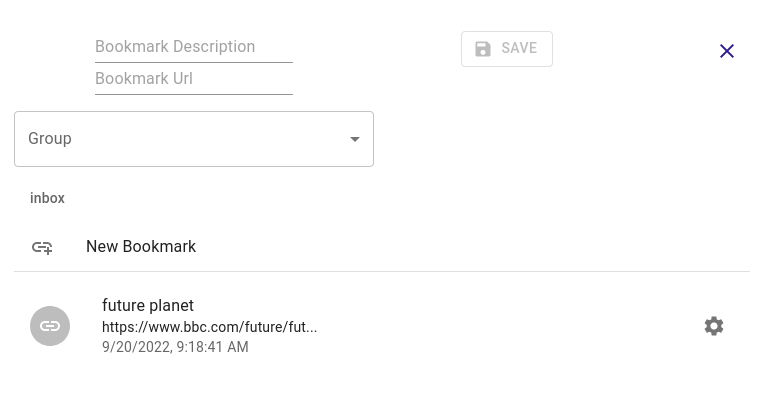
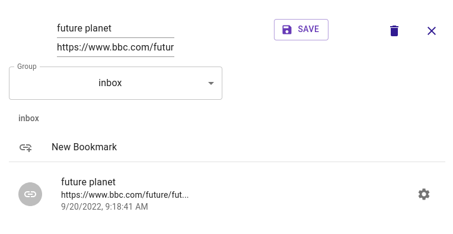

# Bookmarks

This is the section where you manage your bookmarks. You can add, delete and edit bookmarks. 

If no description is entered when creating a bookmark, its url will be a description by default.

If no group is specified while creating a bookmark, it will be registered in the default group, inbox.

