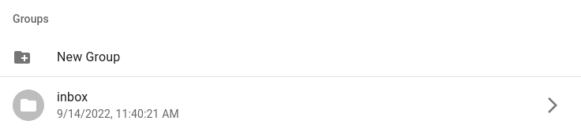
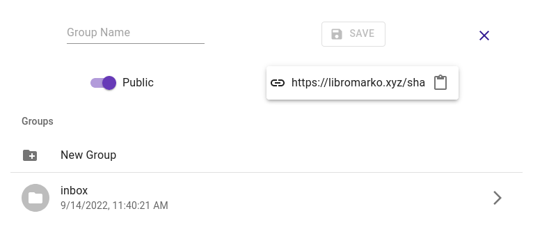
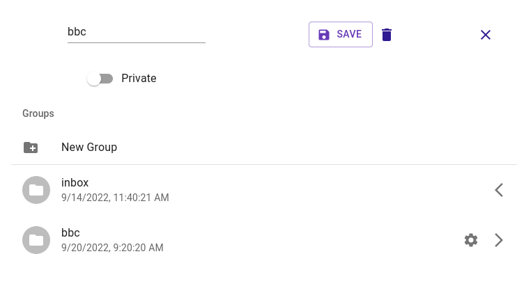

# Groups

You can group your bookmarks with **Groups**.

This is the section where you manage your groups. You can add, delete and edit groups. 

**Inbox is special and default group.** If you don't declare a group when adding a bookmark, its default group will be inbox.

If a group is set to public, a public link is created.

You can reach the editing section by clicking the settings button next to the group.

